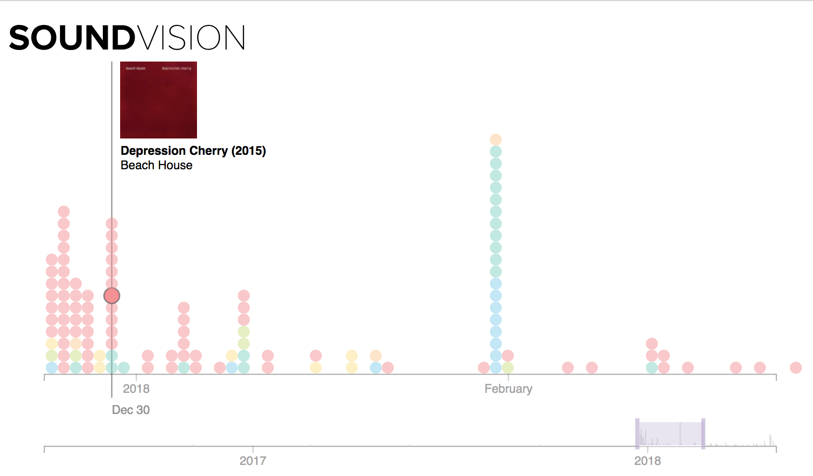

  

# Introduction

[Soundvision](http://www.spotifysoundvision.com) is a web-based visualization tool for exploring listening history and creating playlists. It creates a unique interactive timeline of saved music using D3 and the Spotify API. Users can brush over their history, select albums and tracks, and export playlists to Spotify.

## Usage

**Login**

  

**Selection** (Color indicates the decade of album release)

  

**Creating a Playlist**

  

## Built With

* [React](https://reactjs.org/) - Frontend
* [Passport.js](http://www.passportjs.org/) - Spotify OAuth
* [D3.js](https://github.com/d3/d3) - Interactive Timeline
* [Node](https://github.com/nodejs/node) - Backend
* [MongoDB](https://www.mongodb.com/) - Database
* [Spoitfy Web API](https://beta.developer.spotify.com/documentation/web-api/) - API

## Authors

* **Trevor Manz**

## License

This project is licensed under the MIT License - see the [LICENSE.md](LICENSE.md) file for details
